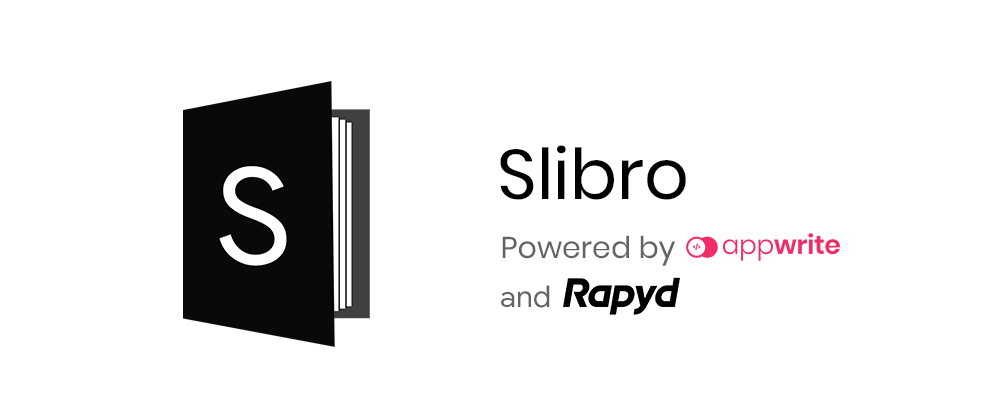
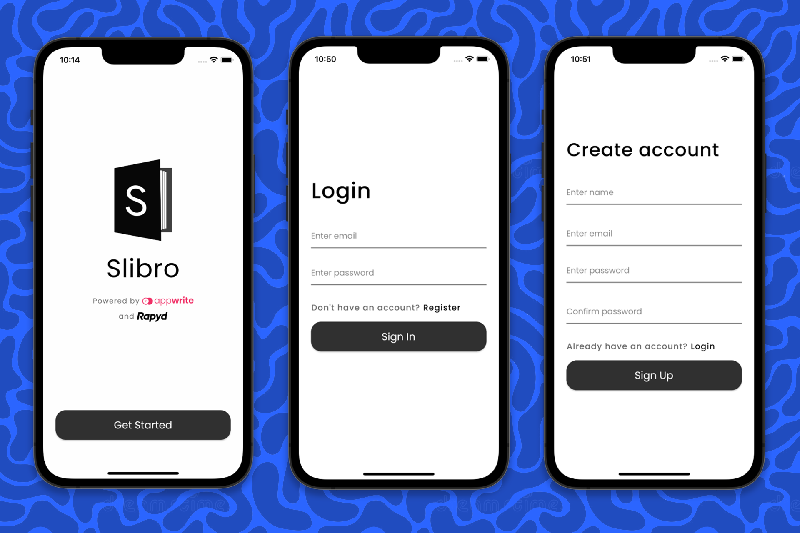
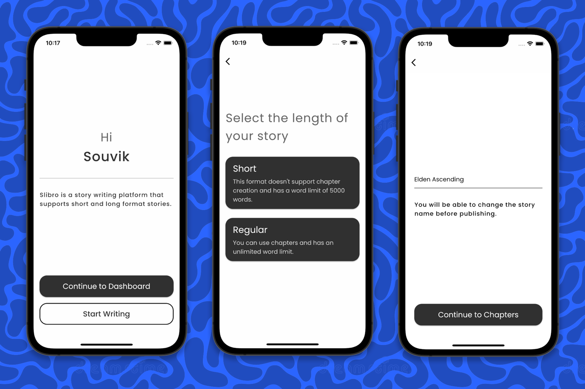
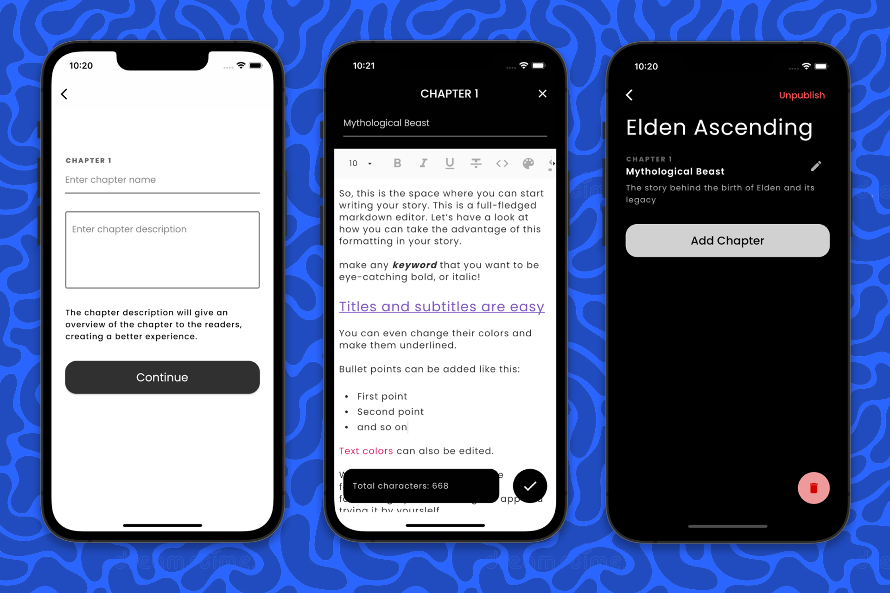
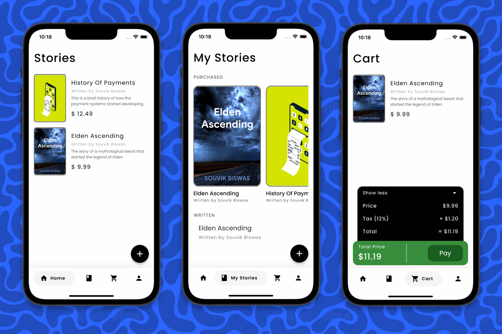
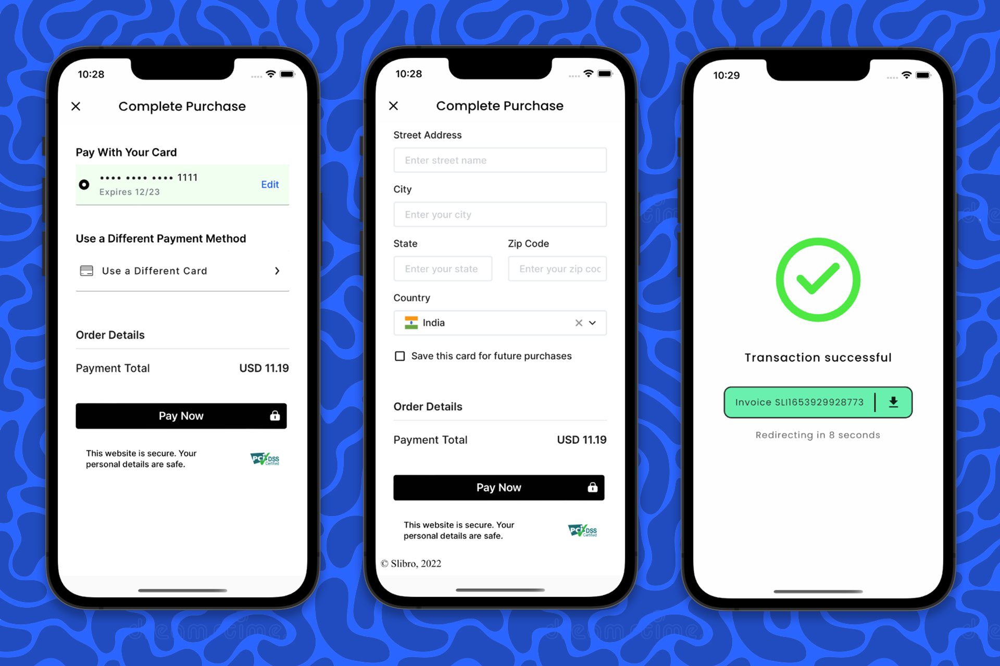

# Slibro [](https://codemagic.io/apps/6240c24a66f743ede7aca591/android-workflow/latest_build)



**Slibro** is a full-fledged story writing and publishing platform that supports short and long format stories. [Flutter](https://flutter.dev/), [Appwrite](https://appwrite.io/), and [Rapyd](https://www.rapyd.net/)  is used to create this amazing cross-platform experience. Though I have focused mainly on the mobile side for building the UI and made sure it's a nice to use on small sized devices.

> Try out the app on Android from [here](https://appdistribution.firebase.dev/i/49e1c8034f8a2ab9).

## Usage

To run this from your system, you should have:

1. [Flutter SDK](https://docs.flutter.dev/get-started/install) installed and configured on your system.
2. Setup Appwrite using Docker.
3. Host the server locally using [ngrok](https://ngrok.com/).
4. Under `lib` directory, create a `secrets.dart` file, and add the server URL and Appwrite project ID to it. Example:

    ```dart
    class Secrets {
      static String hostname = 'https://127b-203-163-244-125.in.ngrok.io/v1';
      static String projectID = '6276341092e81e829ab0';
    }
    ```
5. Create a Rapyd developer account.
6. Get the Rapyd Sandbox API key and secret.
7. Add them to the `secrets.dart` file and use them inside the Rapyd Flutter SDK.
8. Run using the following command:

   ```sh
   flutter run
   ```

## App Overview

The app now has full-fledged **story editor** (rich text - markdown), **story reader**, and **story management system** (to manage published/unpublished stories and explore other publisher's stories).

Some glimpses of Slibro's user interface are as follows:



The above four screens cover the authentication flow on the app using email/password method. These screens help a user to either create a new account or login using an existing account. Once a user signs up to the app, it navigates to the story creation flow.

On a successful registration, a new user is created on Appwrite and a corresponding customer is created on Rapyd.
 


Once authenticated, there are two options - either start writing a new story right away, or navigate to the dashboard of the app.

If the user selects "Start Writing" - the next two screens help a user to create the first story as a draft in the Slibro app. The user can also publish the story following the flow.



The app consists of four main screens:

* **Home Page:** Displays the list of all published stories inside the Slibro app.

* **My Stories Page:** It has two sections, the first section displays your purchased stories (if any), and the next section displays the stories that you have written (if any).

* **Cart Page:** Displays the list of stories that you have specifically added to the cart for purchasing. You can proceed with the checkout from this page.

* **Profile:** Let's you view your profile information along with an options to edit your information. You will also find the log out button on this page.



The following pages shows if the users tries to checkout the cart items. It used the Rapyd Checkout Toolkit to open the embedded web view inside the app - there's a 2-way communication set up between Dart and JS.

User's card information and billing information is taken as a part of this process. And, once the payment is successful an invoice is automatically sent to the user's email via SendGrid. There's also an option to download the invoice.



## Rapyd APIs

The following Rapyd APIs are used in this project:

* [Customer API](https://docs.rapyd.net/build-with-rapyd/reference/customer-object): Used for creating and retrieving the customer information - mainly for storing the saved card information.

* [Checkout API](https://docs.rapyd.net/build-with-rapyd/reference/checkout-page-object): Used for generating and retrieving the checkout ID for the products that the user wants to purchase - it's also required while loading the embedded checkout toolkit inside the app.

## Appwrite APIs

Three of the major Appwrite APIs are used:

* [Account API](https://appwrite.io/docs/client/account?sdk=flutter-default): Used for implementing user authentication and user data management.
* [Database API](https://appwrite.io/docs/client/database?sdk=flutter-default): Used for storing app data related to stories and chapters.
* [Storage API](https://appwrite.io/docs/client/storage?sdk=flutter-default): Used for storing the Rich Text story file in JSON format.

## Flutter packages

A lot of community members for searching for a Flutter SDK to access the Rapyd APIs, so I have started working on a **[Rapyd Flutter SDK](https://pub.dev/packages/rapyd)**. The package is in very early stage of development and has limited APIs to interact with, but has some of the major functionality like calculation of the salt and signature for the header that is required for performing a valid API call.

This SDK should make the Rapyd API calls really easy to perform. Here's a small example of how a new customer can be created using the SDK:

```dart
// Initializing
final rapydClient = RapydClient('<access_key>', '<secret_key>');

try {
  // Creating a new customer
  final customer = await rapydClient.createNewCustomer(
    email: 'example@name.com',
    name: 'User',
  );
  print('Created customer successfully, ID: ${customer.data.id}');
} catch (e) {
  print('ERROR: ${e.toString()}');
}
```

> This project used the Rapyd Flutter SDK for perform the API Calls!

The following Flutter packages are used to build this app:

* [rapyd](https://pub.dev/packages/rapyd)
* [appwrite](https://pub.dev/packages/appwrite)
* [flutter_quill](https://pub.dev/packages/flutter_quill)
* [path_provider](https://pub.dev/packages/path_provider)
* [shared_preferences](https://pub.dev/packages/shared_preferences)
* [google_nav_bar](https://pub.dev/packages/google_nav_bar)
* [tuple](https://pub.dev/packages/tuple)
* [image_cropper](https://pub.dev/packages/image_cropper)
* [image_picker](https://pub.dev/packages/image_picker)
* [http](https://pub.dev/packages/http)
* [convert](https://pub.dev/packages/convert)
* [crypto](https://pub.dev/packages/crypto)
* [webview_flutter_plus](https://pub.dev/packages/webview_flutter_plus)
* [rive](https://pub.dev/packages/rive)
* [printing](https://pub.dev/packages/printing)
* [file_saver](https://pub.dev/packages/file_saver)
* [sendgrid_mailer](https://pub.dev/packages/sendgrid_mailer)

## License

Copyright (c) 2022 Souvik Biswas

Permission is hereby granted, free of charge, to any person obtaining a copy
of this software and associated documentation files (the "Software"), to deal
in the Software without restriction, including without limitation the rights
to use, copy, modify, merge, publish, distribute, sublicense, and/or sell
copies of the Software, and to permit persons to whom the Software is
furnished to do so, subject to the following conditions:

The above copyright notice and this permission notice shall be included in all
copies or substantial portions of the Software.

THE SOFTWARE IS PROVIDED "AS IS", WITHOUT WARRANTY OF ANY KIND, EXPRESS OR
IMPLIED, INCLUDING BUT NOT LIMITED TO THE WARRANTIES OF MERCHANTABILITY,
FITNESS FOR A PARTICULAR PURPOSE AND NONINFRINGEMENT. IN NO EVENT SHALL THE
AUTHORS OR COPYRIGHT HOLDERS BE LIABLE FOR ANY CLAIM, DAMAGES OR OTHER
LIABILITY, WHETHER IN AN ACTION OF CONTRACT, TORT OR OTHERWISE, ARISING FROM,
OUT OF OR IN CONNECTION WITH THE SOFTWARE OR THE USE OR OTHER DEALINGS IN THE
SOFTWARE.
